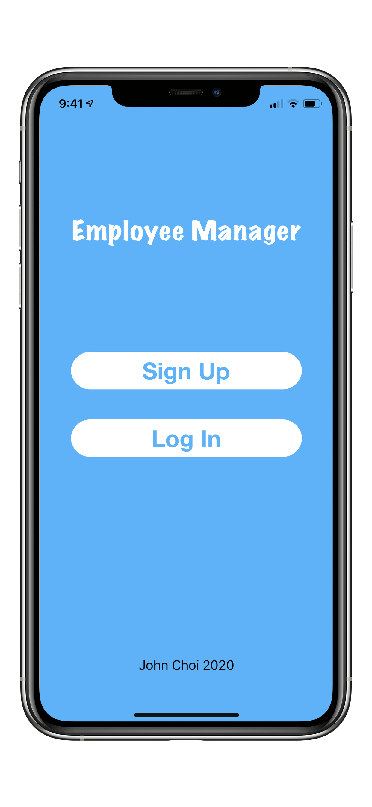
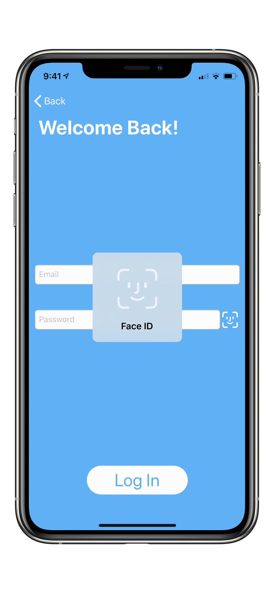
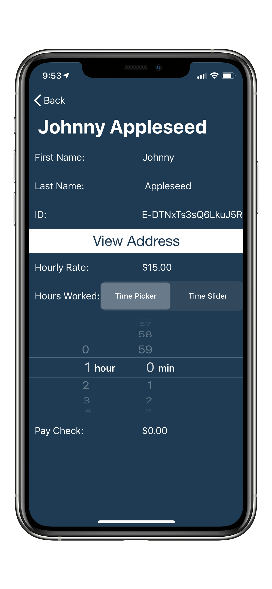
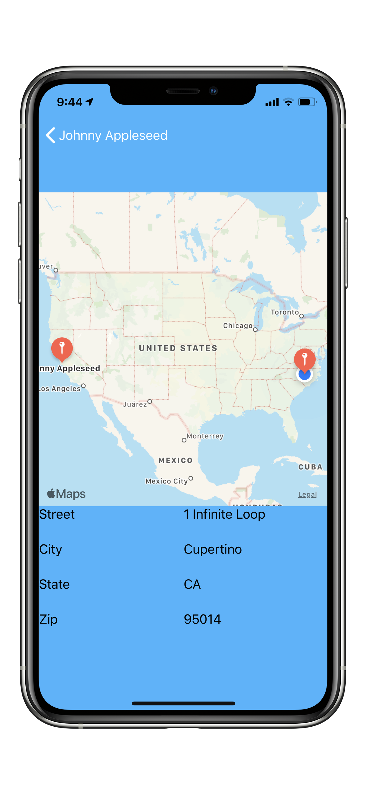

# EmployeeManager-iOS
iOS version of [Employee Manager](https://github.com/johnchoi96/EmployeeManager), re-implemented with Firebase and Swift.

## Requirements
iPhone or iPad running iOS 13.0 or later

## Releases (For authorized devices only)
[Microsoft App Center](https://appcenter.ms/users/johnchoi1003/apps/Employee-Manager/distribute/releases)

## Supported Languages
* English
* Korean

## Screenshots
  

## Dependencies

### CocoaPods

* [MarqueeLabel](https://github.com/cbpowell/MarqueeLabel)

### Swift Package Manager

* [Firebase/Auth](https://firebase.google.com)
* [Firebase/Firestore](https://firebase.google.com)
* [FirebaseFirestoreSwift](https://firebase.google.com)
* [IQKeyboardManagerSwift](https://github.com/hackiftekhar/IQKeyboardManager)

